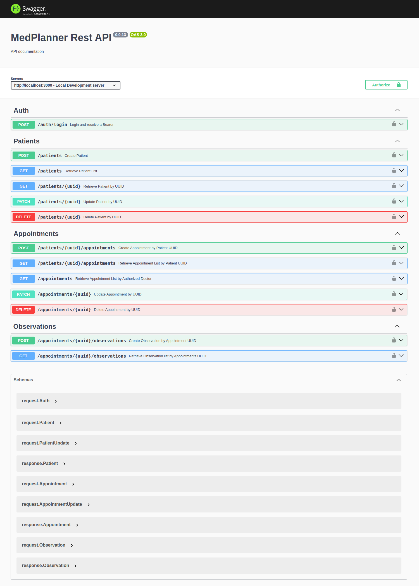
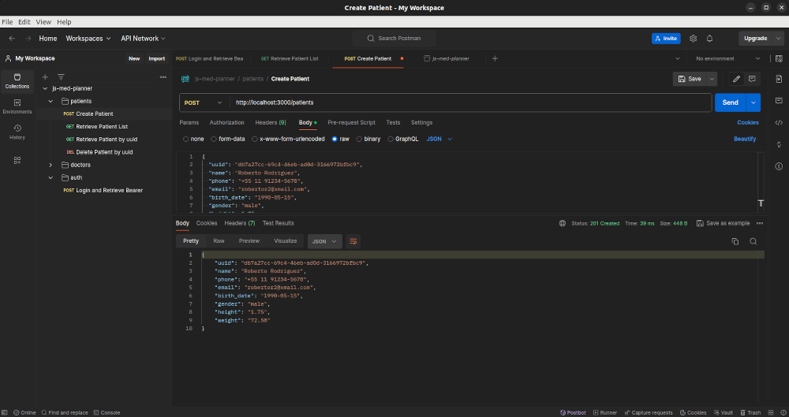
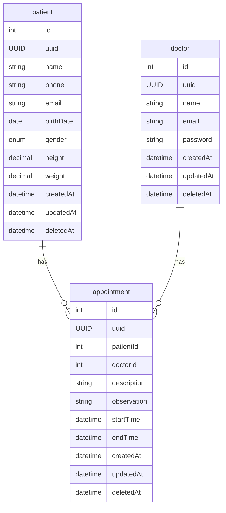
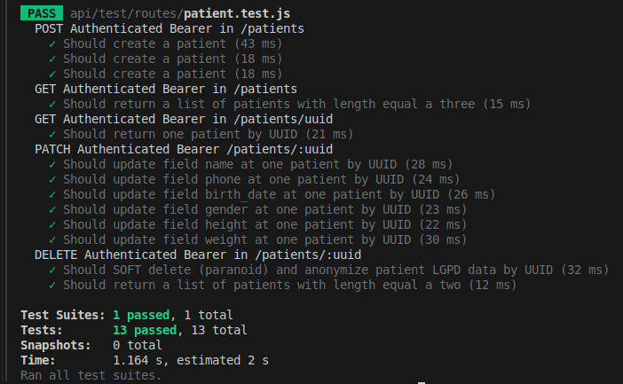
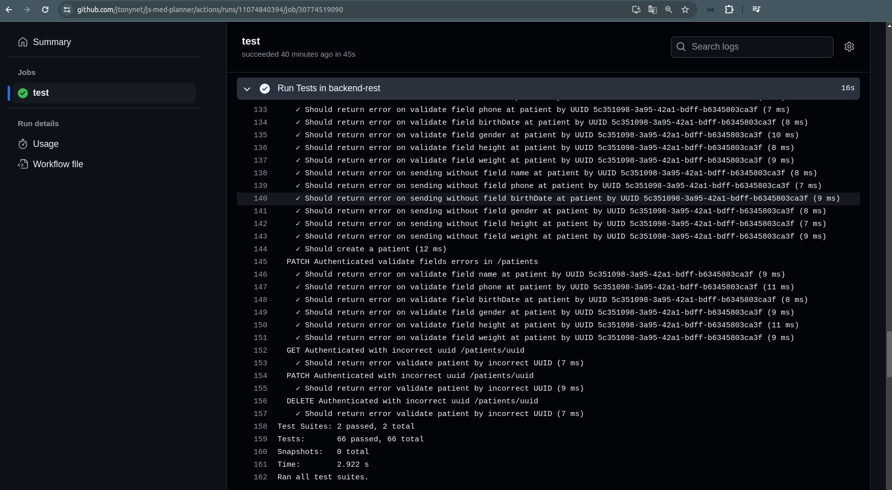

<a id="header"></a>
<!-- 
    Logo image generated by Bing IA: https://www.bing.com/images/create/
-->


<!-- 
    icons by:
    https://devicon.dev/
    https://simpleicons.org/
-->
[](https://nodejs.org/en) [](https://www.npmjs.com/) [](https://eslint.org/) [](https://expressjs.com/) [](https://sequelize.com/) [](https://jestjs.io/) [](https://jwt.io/) [](https://www.docker.com/) [](https://github.com/jtonynet) [](https://code.visualstudio.com/) [](https://www.postgresql.org/) [](https://swagger.io/) [](https://docs.github.com/en/actions) [](https://mermaid.js.org/)

<!-- 
[](https://www.postman.com/)
[](https://www.npmjs.com/package/dotenv)
[](https://aws.amazon.com/pt/) [](https://www.passportjs.org/) [](https://prometheus.io/) [](https://grafana.com/)
-->

[](#header) [](https://github.com/users/jtonynet/projects/6)  

---

## 🕸️ Redes

[](https://www.linkedin.com/in/jos%C3%A9-r-99896a39/) [](https://dev.to/learningenuity) [](mailto:learningenuity@gmail.com)

---

## 📁 O Projeto

<a id="index"></a>
### ⤴️ Índice

__[Med Planner Challenge](#header)__<br/>
  1.  ⤴️ [Índice](#index)
  2.  📖 [Sobre](#about)
  3.  💻 [Rodando o Projeto](#run)
  4.  📰 [Documentação da API](#api-docs)
  5.  📊 [Diagramas](#diagrams)
  6.  ✅ [Testes](#tests)
  7.  👏 [Boas Práticas](#best-practices)
  8.  🧠 [ADR - Architecture Decision Records](#adr)
  9.  🔢 [Versões](#versions)
  10. 🧰 [Ferramentas](#tools)
  11. 🤖 [Uso de AI](#ia)
  12. 🏁 [Conclusão](#conclusion)

---

<a id="about"></a>
### 📖 Sobre

Acompanhe as tarefas pelo [__Kanban__](https://github.com/users/jtonynet/projects/6)

Este repositório foi criado com a intenção de propor uma possível solução para o seguinte desafio:

> 👨‍💻 __Case Dev Backend:__
> 
> Construir o backend para um sistema de prontuário eletrônico onde o médico pode
cadastrar as informações do paciente como nome, telefone, data de nascimento, sexo,
altura e peso e fazer os registros das consultas realizadas por paciente.

> __1. Requisitos funcionais:__
> 
> - __Requisitos obrigatórios:__
>   - Eu, como médico, quero poder cadastrar um paciente com os seguintes
dados: nome, telefone, email, data de nascimento, sexo, altura e peso.
>   - Eu, como médico, quero poder listar e editar o perfil dos pacientes cadastrados.
>   - Eu, como médico, quero poder cadastrar um agendamento de consulta para
um paciente.
>   - Eu, como médico, quero poder listar, alterar e excluir os agendamentos de consulta.
>   - Eu, como médico, quero poder anotar uma observação durante a consulta.
>   - Eu, como médico, quero poder visualizar as anotações das consultas dos pacientes.
> 
> - __Requisitos desejáveis:__
>   - Eu como médico, quero que o sistema valide a minha agenda, não deixando
eu cadastrar mais de um paciente na mesma hora.
>   - Eu, como médico, quero poder excluir os dados pessoais do paciente por causa
das novas regras do LGPD, mas mantendo o histórico de consulta por questões de contabilidade
>
>
>
>  __2. Requisitos não funcionais:__
> - __Requisitos obrigatórios__
>   - Deve usar o padrão de API REST (HTTP/JSON);
>   - Pode ser feito em __node.js__ (javascript ou typescript) ou PHP (laravel);
>   - Documentação da interface da API gerada (swagger, open-api, RAML ou postman);
>   - Os dados devem ser validados (existência e formatos) na inserção/atualização
para garantir consistência da base;
>   - Implementar testes unitários e/ou de integração e/ou documentação de testes
(casos de teste / script de teste).
>
> - __Requisitos desejáveis__
>   - Documentação da modelagem do banco de dados (diagrama ER ou de classe);
>   - Para o banco de dados pode usar MySQL ou PostgreSQL, podendo optar ou
não pelo uso de ORM;
>   - Setup de ambiente de desenvolvimento usando docker / docker-compose;
>   - Hospedar em um ambiente cloud a sua escolha (Heroku, AWS EBS, IBM Cloud, etc);
>   - Garantir autenticação e/ou autorização (login/logout, token JWT, roles);
>   - Implementar alguma ferramenta de lint ou qualidade (sonar, code-quality, eslint, etc);
>   - Deploy automatizado via pipeline (gitlab-ci, bitbucket pipeline, github actions, etc).


_*A documentação original do desafio é mais abrangente, com sugestões de tela para o front e mais dados._

Faz sentido utilizar __Arquitetura de Duas Camadas__. Caso a complexidade aumente, podemos extender para o uso de uma terceira camada (`services/repository`).


[⤴️ de volta ao índice](#index)

---

<a id="run"></a>
### 💻 Rodando o Projeto

<a id="environment"></a>
#### 🌐 Ambiente
Docker e Docker Compose são necessários para rodar a aplicação de forma containerizada, e é fortemente recomendado utilizá-los para rodar o banco de dados localmente.

Crie uma copia do arquivo `./backend-rest/.env.SAMPLE` e renomeie para `./backend-rest/.env`.

<br/>

<a id="run-containerized"></a>
#### 🐋 Conteinerizado 

Com a `.env` editada, rode os comandos `docker compose` (de acordo com sua versão do docker compose) no diretório raiz do projeto:
```bash
/js-med-planner$ docker compose build
/js-med-planner$ docker compose up postgres-med-planner -d
/js-med-planner$ docker compose up backend-rest
```
Caso seja a primeira vez que o projeto esteja sendo iniciado, será necessário rodar as migrations do banco de dados. O seguinte comando pode ser utilizado sempre que for necessário criar ou resetar o banco de dados de desenvolvimento local:
```bash
/js-med-planner$ docker compose exec backend-rest npm run db:clean
```
Após a base ser (re)construída, a API esta pronta e a rota da [documentação swagger](#api-docs) estará disponível, assim como a [suite de testes](#tests) poderá ser executada.

<!-- 
  docker compose exec backend-rest npm run db:clean

  /js-med-planner$ docker compose up postgres-med-planner backend-rest 
  /js-med-planner$ docker compose up postgres-med-planner test-postgres-med-planner 
-->

<br/>

<a id="run-locally"></a>
#### 🏠 Local

Com o Node 20.17.0 instalado e após seguir os comandos de edição do arquivo `./backend-rest/.env`, serão necessárias outras alterações para que a aplicação funcione corretamente no seu localhost. Observe que há linhas com comentários semelhantes ao seguinte:
```bash
# local: 127.0.0.1 || conteinerized: postgres-med-planner
```
Substitua os valores das `envs` com esses comentarios para o valor sugerido na primeira opcao `local`
```bash
DB_HOST=127.0.0.1 # local: 127.0.0.1 || conteinerized: postgres-med-planner
```

Após editar o arquivo, suba apenas o banco de dados com o comando:

```
/js-med-planner$ docker compose up postgres-med-planner
```
ou se conecte a uma database válida, então vá para o diretório `backend-rest` e execute os comandos:

```bash
/js-med-planner/backend-rest$ npm install
/js-med-planner/backend-rest$ npm run dev
```
Use `npm run db:clean` para (re)construir o DB de desenvolvimento se necessario
<br/>


<br/>

[⤴️ de volta ao índice](#index)

---

<a id="api-docs"></a>
### 📰  Documentação da API

####    Swagger

Com a aplicação em execução, a rota de documentação Swagger fica disponível em http://localhost:3000/docs/

O endpoint `/auth/login` provê um token `Bearer` que deve ser obtido e utilizado no `Authorize` do swagger para que as requisições possam ser procedidas adequadamente.

O cliente deve informar o UUID do recurso para criação. Para validações, você pode utilizar um [site gerador de UUIDs](https://www.uuidgenerator.net/).



<br/>

<!-- 
####    Postman

Dentro da pasta [./scripts/postman](./scripts/postman/rjs-med-planner.postman_collection.json) encontra-se o arquivo JSON básico que pode ser importado no seu `Postman` para auxiliar em testes manuais e desenvolvimento.</summary>


-->

<br/>

[⤴️ de volta ao índice](#index)

---

<a id="diagrams"></a>
### 📊 Diagramas do Sistema
_Diagramas Mermaid podem apresentar problemas de visualização em aplicativos mobile_

<!-- 
    diagrams by:
    https://mermaid.js.org/
-->

**ER:**



   1. A abordagem da tabela `doctor` com o campo `password` foi aplicada apenas para ter uma autenticação minima nos endpoints dos recursos desde o inicio. Caso alcance todos os requisitos obrigatórios do desafio e tenha tempo disponível, pretendo implementar `user` com `roles` adequadas e uma política de `refresh-token`
<br/>

<br/>

<!-- 
    diagrams by:
    https://mermaid.js.org/
-->

[⤴️ de volta ao índice](#index)

---

<a id="tests"></a>
### ✅ Testes

Com o projeto da backend-rest [adequadamente instalado](#run) em seu ambiente local ou conteinerizado, levante o banco de testes com

```bash
/js-med-planner$ docker compose up test-postgres-med-planner -d
```

e execute o comando:
```bash
/js-med-planner$ docker compose exec backend-rest npm run test
```
ou então vá para o diretório da API e execute o comando de testes:

```bash
/js-med-planner/backend-rest$ npm run test
```

Cada vez que o comando for executado, a database de testes será recriada no test-postgres-med-planner assegurando uma execução limpa.
Saída esperada pelo comando:


Os testes também são executados como parte da rotina minima de __CI__ do <a href="https://github.com/jtonynet/go-products-api/actions">GitHub Actions</a>, garantindo que versões estáveis sejam mescladas na branch principal. O badge __TESTS_CI__ no [cabeçalho](#header) do arquivo readme é uma ajuda visual para verificar rapidamente a integridade do desenvolvimento.


Essa abordagem deve evoluir para uma rotina adequada de __CD__ no futuro.

<br/>

[⤴️ de volta ao índice](#index)

---

<a id="best-practices"></a>
### 👏 Boas Práticas

- [Swagger](https://swagger.io/)
- [Github Project - Kanbam](https://github.com/users/jtonynet/projects/6)
- [Semantic Versioning 2.0.0](https://semver.org/spec/v2.0.0.html)
- [Conventional Commits](https://www.conventionalcommits.org/en/v1.0.0/)
- [Keep a Changelog](https://keepachangelog.com/en/1.0.0/)
- [ADR - Architecture Decision Records](https://cognitect.com/blog/2011/11/15/documenting-architecture-decisions)
- [Mermaid Diagrams](https://mermaid.js.org)
<!--
- [Observabilidade](https://en.wikipedia.org/wiki/Observability_(software)) com:
  - [Prometheus](.)
  - [Grafana](https://grafana.com/)
-->

<br/>

[⤴️ de volta ao índice](#index)

---

<a id="adr"></a> 
### 🧠 ADR - Architecture Decision Records

- [0001: Registro de Decisões de Arquitetura (ADR)](./docs/architecture/decisions/0001-registro-de-decisoes-de-arquitetura.md)
- [0002: Express, Sequelize e Postgres em API TDD Jest com arquitetura de Duas camadas](./docs/architecture/decisions/0002-express-sequelize-e-postgres-tdd-jest-com-arquitetura-de-api-em-duas-camadas.md)

<br/>

[⤴️ de volta ao índice](#index)

---

<a id="versions"></a>
### 🔢 Versões

As tags de versões estão sendo criadas manualmente a medida que o projeto avança com melhorias notáveis. Cada funcionalidade é desenvolvida em uma branch a parte (Branch Based, [feature branch](https://www.atlassian.com/git/tutorials/comparing-workflows/feature-branch-workflow)) quando finalizadas é gerada tag e mergeadas em master.

Para obter mais informações, consulte o [Histórico de Versões](./CHANGELOG.md).

<br/>

[⤴️ de volta ao índice](#index)

---

<a id="tools"></a>
### 🧰 Ferramentas

- Linguagem:
  - [NodeJS v20.17.0](https://nodejs.org/en)
  - [NVM](https://github.com/nvm-sh/nvm)

- Framework & Libs:
  - [Express 4.21.0](https://expressjs.com/)
  - [Jest](https://jestjs.io/pt-BR/)
  - [Sequelize 6.37.3](https://sequelize.org/)

- Infra & Technologias
  - [Docker v24.0.6](https://www.docker.com/)
  - [Docker compose v2.21.0](https://www.docker.com/)
  - [MySQL](https://www.postgresql.org/)

- GUIs:
  - [VsCode](https://code.visualstudio.com/)

  <!--
  - [Postman](https://blog.postman.com/introducing-the-postman-vs-code-extension/)
  --> 

<br/>

[⤴️ de volta ao índice](#index)

---

<a id="ia"></a>
### 🤖 Uso de AI

A figura do cabeçalho nesta página foi criada com a ajuda de inteligência artificial e um mínimo de retoques e construção no Gimp [](https://www.gimp.org/)


__Os seguintes prompts foram usados para criação no  [Bing IA:](https://www.bing.com/images/create/)__


<details>
  <summary><b>Jovem Médica</b></summary>
"medica mulher afrodescendente de óculos segurando um Smartphone e olhando atentamente para ele com um leve sorriso. Fundo branco para fácil remoção, estilo cartoon cores chapadas, historia em quadrinhos" <b>(sic)</b>
</details>

<br/>

__Arte e desenvolvimento são, acima de tudo, atividades criativas humanas. Valorize as pessoas!__

Contrate artistas para projetos comerciais ou mais elaborados e aprenda a ser engenhoso!

[⤴️ de volta ao índice](#index)

<br/>

---

<a id="conclusion"></a>
### 🏁 Conclusão

Mantive o desenvolvimento focado em atingir os requisitos obrigatórios, com testes de integração e validações, em uma estrutura simples de duas camadas, pois o problema não parecia exigir mais do que isso, embora a ausência de testes unitarios seja sentida.

Validar o conflito de horários de agendamento me pareceu o ponto central da API. Adotei, por padrão, o timezone America/Sao_Paulo para evitar conflitos (facilitando o desenvolvimento). Uma solução mais robusta pode ser implementada caso seja necessário lidar com diferentes fusos horários.

Deletar os dados do paciente, adotei soft delete (paranoid) e criptografia simples por simplicidade e tempo. A abordagem correta é utilizar uma estratégia de Crypto-Shredding, que "remove" também dos backups.

Embora exista uma branch com o rascunho inicial do front-end que consumiria a API, resolvi focar esforços na própria API, buscando aderência à posição e aos demais desafios propostos, visando produtividade.

Os testes de integração estão rodando conforme o CI. Não tive tempo hábil para criar e me aprofundar em uma esteira de CD, mas esse é um tema que me interessa.

Desde o início, preocupei-me com uma autenticação mínima para permitir que o projeto evoluísse sem a necessidade de grandes refactors quando recursos mais avançados, como roles e refresh tokens, fossem necessários.

Essas são minhas considerações sobre o que consegui produzir ao longo desse desafio, e continuarei me aplicando aos pontos cegos que não tive tempo ou conhecimento para aprimorar.


😊🚀

<br/>

[⤴️ de volta ao índice](#index)

---

<!-- 
Teste concorrendo com a app, derrubar porta 300
sudo kill -9 $(lsof -t -i:3000)

Criando Modelos com o cli do sequelize

```bash
sequelize model:create --name patients --attributes uuid:uuid,name:string,phone:string,email:string,birthDate:date,gender:string,height:float,weight:float
```

```bash
sequelize model:create --name doctors --attributes uuid:uuid,name:string,email:string,password:string
sequelize seed:create --name create-initial-doctor

sequelize model:create --name appointments --attributes uuid:uuid,patientId:int,doctorId:int,description:string,startTime:date,endTime:date

sequelize model:create --name observations --attributes uuid:uuid,appointmentId:int,message:string
```

//LIMPANDO DOCKER

docker stop $(docker ps -aq)
docker rm $(docker ps -aq)

docker rmi $(docker images -q) --force

docker volume rm $(docker volume ls -q) --force

docker network prune -f

docker system prune -a --volumes

sudo systemctl restart docker

-->


