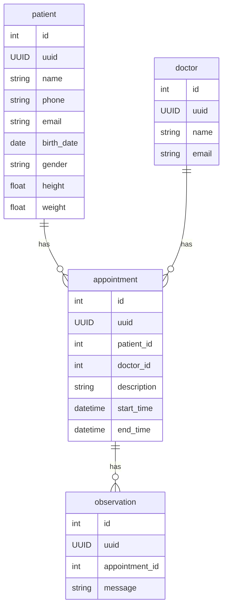

<a id="header"></a>
<!-- 
    Logo image generated by Bing IA: https://www.bing.com/images/create/
-->


<!-- 
    icons by:
    https://devicon.dev/
    https://simpleicons.org/
-->
[](https://nodejs.org/en) [](https://www.npmjs.com/) [](https://www.npmjs.com/package/dotenv) [](https://eslint.org/) [](https://expressjs.com/) [](https://sequelize.com/) [](https://jestjs.io/) [](https://www.docker.com/) [](https://github.com/jtonynet) [](https://code.visualstudio.com/) [](https://www.postman.com/) [](https://www.postgresql.org/) [](https://swagger.io/) [](https://docs.github.com/en/actions) [](https://mermaid.js.org/)

<!-- 
[](https://www.passportjs.org/) [](https://prometheus.io/) [](https://grafana.com/)
-->

[](#header) [](https://github.com/users/jtonynet/projects/6) <!--  -->

---

## 🕸️ Redes

[](https://www.linkedin.com/in/jos%C3%A9-r-99896a39/) [](https://dev.to/learningenuity) [](mailto:learningenuity@gmail.com)

---

## 📁 O Projeto

<a id="index"></a>
### ⤴️ Índice

__[Med Planner Challenge](#header)__<br/>
  1.  ⤴️ [Índice](#index)
  2.  📖 [Sobre](#about)
  3.  💻 [Rodando o Projeto](#run)
  4.  📰 [Documentação da API](#api-docs)
  5.  📊 [Diagramas](#diagrams)
  6.  ✅ [Testes](#tests)
  7.  👏 [Boas Práticas](#best-practices)
  8.  🧠 [ADR - Architecture Decision Records](#adr)
  9.  🔢 [Versões](#versions)
  10. 🧰 [Ferramentas](#tools)
  11. 🤖 [Uso de AI](#ia)
  12. 🏁 [Conclusão](#conclusion)

---

<a id="about"></a>
### 📖 Sobre

Acompanhe as tarefas pelo [__Kanban__](https://github.com/users/jtonynet/projects/6)

Este repositório foi criado com a intenção de propor uma possível solução para o seguinte desafio:

> 👨‍💻 __Case Dev Backend:__
> 
> Construir o backend para um sistema de prontuário eletrônico onde o médico pode
cadastrar as informações do paciente como nome, telefone, data de nascimento, sexo,
altura e peso e fazer os registros das consultas realizadas por paciente.

> __1. Requisitos funcionais:__
> 
> - __Requisitos obrigatórios:__
>   - Eu, como médico, quero poder cadastrar um paciente com os seguintes
dados: nome, telefone, email, data de nascimento, sexo, altura e peso.
>   - Eu, como médico, quero poder listar e editar o perfil dos pacientes cadastrados.
>   - Eu, como médico, quero poder cadastrar um agendamento de consulta para
um paciente.
>   - Eu, como médico, quero poder listar, alterar e excluir os agendamentos de consulta.
>   - Eu, como médico, quero poder anotar uma observação durante a consulta.
>   - Eu, como médico, quero poder visualizar as anotações das consultas dos pacientes.
> 
> - __Requisitos desejáveis:__
>   - Eu como médico, quero que o sistema valide a minha agenda, não deixando
eu cadastrar mais de um paciente na mesma hora.
>   - Eu, como médico, quero poder excluir os dados pessoais do paciente por causa
das novas regras do LGPD, mas mantendo o histórico de consulta por questões de contabilidade
>
>
>
>  __2. Requisitos não funcionais:__
> - __Requisitos obrigatórios__
>   - Deve usar o padrão de API REST (HTTP/JSON);
>   - Pode ser feito em __node.js__ (javascript ou typescript) ou PHP (laravel);
>   - Documentação da interface da API gerada (swagger, open-api, RAML ou postman);
>   - Os dados devem ser validados (existência e formatos) na inserção/atualização
para garantir consistência da base;
>   - Implementar testes unitários e/ou de integração e/ou documentação de testes
(casos de teste / script de teste).
>
> - __Requisitos desejáveis__
>   - Documentação da modelagem do banco de dados (diagrama ER ou de classe);
>   - Para o banco de dados pode usar MySQL ou PostgreSQL, podendo optar ou
não pelo uso de ORM;
>   - Setup de ambiente de desenvolvimento usando docker / docker-compose;
>   - Hospedar em um ambiente cloud a sua escolha (Heroku, AWS EBS, IBM Cloud, etc);
>   - Garantir autenticação e/ou autorização (login/logout, token JWT, roles);
>   - Implementar alguma ferramenta de lint ou qualidade (sonar, code-quality, eslint, etc);
>   - Deploy automatizado via pipeline (gitlab-ci, bitbucket pipeline, github actions, etc).


_*A documentação original do desafio é mais abrangente, com sugestões de tela para o front e mais dados. Coloquei aqui os principais pontos sem citar o proponente._

Faz sentido utilizar __Arquitetura de Duas Camadas__. Construido junto a uma visualização estilo __Kanban__ no Github Project. Caso exista a necessidade e a complexidade aumentar, o projeto pode ser extendido para o uso de uma terceira camada.

Foco em garantir estabilidade com __TDD__ e uma implementação de __CI__ no GitHub Actions

[⤴️ de volta ao índice](#index)

---

<a id="run"></a>
### 💻 Rodando o Projeto

<a id="run-containerized"></a>
#### Rodando Conteinerizado

Rode os comandos `docker compose` (de acordo com sua versão do docker compose) no diretório raiz do projeto:
```
/js-med-planner$ docker compose build
/js-med-planner$ docker compose up
```
Acesse a rota: `http://localhost:8080/patients`


<a id="run-locally"></a>
#### Rodando Local

API:
Com o node 20.17.0 instalado, vá para o diretório `rest-api` e execute os comandos:

```bash
/js-med-planner/rest-api$ npm install
/js-med-planner/rest-api$ npm run dev
```

<br/>

[⤴️ de volta ao índice](#index)

---

<a id="api-docs"></a>
### 📰  Documentação da API

__TODO__

<br/>

<!-- 
Com a aplicação em execução, a rota de documentação Swagger fica disponível em http://localhost:8080/swagger/index.html#/ .

Acesse-a para realizar validações, caso prefira ao usar o Postman. Utilizar o Swagger-API também é uma boa maneira de tornar a aplicação aderente às boas práticas e ao design de API.

O cliente deve informar o UUID do recurso, seguindo as modernas práticas de desenvolvimento. Para validações, você pode utilizar um [site gerador de UUIDs](https://www.uuidgenerator.net/). Outras restrições e características dos recursos que podem ser criados, obtidos, listados e deletados podem ser visualizadas na seção 'Models' do Swagger.

####   Swagger docs
-->

[⤴️ de volta ao índice](#index)

---

<a id="diagrams"></a>
### 📊 Diagramas do Sistema
_Diagramas Mermaid podem apresentar problemas de visualizacao em aplicativos mobile_

<!-- 
    diagrams by:
    https://mermaid.js.org/
-->

**ER:**



<br/>

**Diagrama de Sistema:**

```mermaid
graph LR
    subgraph Doctor Flow
      ADMIN(["👤 Doctor"])

      ADMIN --> CREATE_PATIENT("💻 Create Patient")
      ADMIN --> RETRIEVE_PATIENT_LIST("💻 Retrieve Patient List")
      ADMIN --> RETRIEVE_PATIENT("💻 Retrieve Patient")
      ADMIN --> UPDATE_PATIENT("💻 Update Patient")
    end

    subgraph Two Tier Architecture -
      subgraph Handlers
        API_CREATE_PATIENT("🖥️ Create Patient")
        API_GET_PATIENTS("🖥️ Get Patient")
        API_GET_PATIENT("🖥️ Get Patient by UUID")
        API_UPDATE_PATIENT("🖥️ Update Patient by UUID")
      end

      subgraph Entities
        ENTITY_PATIENT("📄 Patient")
      end

      subgraph DATABASE
        MED_PLANNER_DB[("🗄️ PostgreSQL <br/> med-planner-db")]
      end 
    end
  
  CREATE_PATIENT -->|http POST| API_CREATE_PATIENT
  RETRIEVE_PATIENT_LIST -->|http GET| API_GET_PATIENTS
  RETRIEVE_PATIENT -->|http GET| API_GET_PATIENT
  UPDATE_PATIENT -->|http PATCH| API_UPDATE_PATIENT

  API_CREATE_PATIENT-->ENTITY_PATIENT
  API_GET_PATIENTS-->ENTITY_PATIENT
  API_GET_PATIENT-->ENTITY_PATIENT
  API_UPDATE_PATIENT-->ENTITY_PATIENT 


  ENTITY_PATIENT-->MED_PLANNER_DB
```


_*Diagrama INICIAL geral com baixo nível de fidelidade_


<br/>

<!-- 
    diagrams by:
    https://mermaid.js.org/
-->

[⤴️ de volta ao índice](#index)

---

<a id="tests"></a>
### ✅ Testes

Com o projeto da rest-api [adequadamente instalado](#run-locally) em seu ambiente local, vá para o diretório do mesmo e execute o comando de testes:

```bash
/js-med-planner/rest-api$ npm run test
```

<br/>

[⤴️ de volta ao índice](#index)

---

<a id="best-practices"></a>
### 👏 Boas Práticas

- [Swagger](https://swagger.io/)
- [Github Project - Kanbam](https://github.com/users/jtonynet/projects/5/views/1)
- [Semantic Versioning 2.0.0](https://semver.org/spec/v2.0.0.html)
- [Conventional Commits](https://www.conventionalcommits.org/en/v1.0.0/)
- [Keep a Changelog](https://keepachangelog.com/en/1.0.0/)
- [ADR - Architecture Decision Records](https://cognitect.com/blog/2011/11/15/documenting-architecture-decisions)
- [Mermaid Diagrams](https://mermaid.js.org)
<!--
- [Observabilidade](https://en.wikipedia.org/wiki/Observability_(software)) com:
  - [Prometheus](.)
  - [Grafana](https://grafana.com/)
-->

<br/>

[⤴️ de volta ao índice](#index)

---

<a id="adr"></a> 
### 🧠 ADR - Architecture Decision Records

- [0001: Registro de Decisões de Arquitetura (ADR)](./docs/architecture/decisions/0001-registro-de-decisoes-de-arquitetura.md)
- [0002: Express, Sequelize e Postgres em API TDD Jest com arquitetura de Duas camadas](./docs/architecture/decisions/0002-express-sequelize-e-postgres-tdd-jest-com-arquitetura-de-api-em-duas-camadas.md)

<br/>

[⤴️ de volta ao índice](#index)

---

<a id="versions"></a>
### 🔢 Versões

As tags de versões estão sendo criadas manualmente a medida que o projeto avança com melhorias notáveis. Cada funcionalidade é desenvolvida em uma branch a parte (Branch Based, [feature branch](https://www.atlassian.com/git/tutorials/comparing-workflows/feature-branch-workflow)) quando finalizadas é gerada tag e mergeadas em master.

Para obter mais informações, consulte o [Histórico de Versões](./CHANGELOG.md).

<br/>

[⤴️ de volta ao índice](#index)

---

<a id="tools"></a>
### 🧰 Ferramentas

- Linguagem:
  - [NodeJS v20.17.0](https://nodejs.org/en)
  - [NVM](https://github.com/nvm-sh/nvm)

- Framework & Libs:
  - [Express 4.21.0](https://expressjs.com/)
  - [Jest](https://jestjs.io/pt-BR/)
  - [Sequelize 6.37.3](https://sequelize.org/)
  - [.env](https://www.npmjs.com/package/dotenv)

- Infra & Technologias
  - [Docker v24.0.6](https://www.docker.com/)
  - [Docker compose v2.21.0](https://www.docker.com/)
  - [MySQL](https://www.postgresql.org/)
<!--
  - [Prometheus](https://prometheus.io/docs/guides/go-application)
  - [Grafana](https://grafana.com/)
-->

- GUIs:
  - [VsCode](https://code.visualstudio.com/)
  - [Postman](https://blog.postman.com/introducing-the-postman-vs-code-extension/)

<br/>

[⤴️ de volta ao índice](#index)

---

<a id="ia"></a>
### 🤖 Uso de AI

A figura do cabeçalho nesta página foi criada com a ajuda de inteligência artificial e um mínimo de retoques e construção no Gimp [](https://www.gimp.org/)


__Os seguintes prompts foram usados para criação no  [Bing IA:](https://www.bing.com/images/create/)__


<details>
  <summary><b>Jovem Médica</b></summary>
"medica mulher afrodescendente de óculos segurando um Smartphone e olhando atentamente para ele com um leve sorriso. Fundo branco para fácil remoção, estilo cartoon cores chapadas, historia em quadrinhos" <b>(sic)</b>
</details>

<br/>

__Arte e desenvolvimento são, acima de tudo, atividades criativas humanas. Valorize as pessoas!__

Contrate artistas para projetos comerciais ou mais elaborados e aprenda a ser engenhoso!

[⤴️ de volta ao índice](#index)

<br/>

---

<a id="conclusion"></a>
### 🏁 Conclusão

__TODO__

😊🚀

<br/>

[⤴️ de volta ao índice](#index)

---
